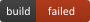

Chutney Status
===============
chutney status icons library based on node-canvas

### Supported status




### Installation

```sh
$ npm install chutney-status
```

### Usage

```
var icon1 = new PassingIcon();
icon1.pipe(fs.createWriteStream(path.join(__dirname, './passing.png')));

var icon2 = new FailedIcon();
icon2.pipe(fs.createWriteStream(path.join(__dirname, './failed.png')));
```

### License

MIT